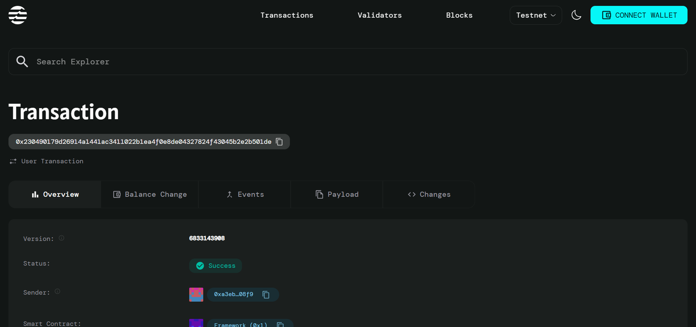

# Time Utilities

## Project Description

Time Utilities is a smart contract built on the Aptos blockchain that provides time-based calculations and scheduling systems. This contract enables users to create scheduled tasks with precise timing controls, duration management, and execution readiness verification. The system leverages Aptos's built-in timestamp functionality to provide reliable time-based operations for decentralized applications.

## Project Vision

Our vision is to create a foundational time management infrastructure on the Aptos blockchain that enables developers to build sophisticated scheduling and time-dependent applications. We aim to provide simple, reliable, and efficient time utilities that can serve as building blocks for more complex temporal logic in smart contracts, from simple reminders to complex automated scheduling systems.

## Key Features

- **Scheduled Task Creation**: Create tasks with specific execution times and durations
- **Time-based Validation**: Automatic validation ensuring scheduled times are in the future
- **Execution Readiness Check**: Real-time verification of whether tasks are ready to execute
- **Duration Management**: Built-in support for task duration tracking
- **Timestamp Integration**: Seamless integration with Aptos framework timestamp functionality
- **Error Handling**: Comprehensive error codes for invalid operations
- **View Functions**: Query task information without state modifications
- **Lightweight Design**: Optimized smart contract under 50 lines of code

## Future Scope

### Phase 1 Enhancements
- **Recurring Tasks**: Support for repeating scheduled tasks (daily, weekly, monthly)
- **Task Cancellation**: Ability to cancel or modify existing scheduled tasks
- **Multiple Tasks**: Allow users to create and manage multiple scheduled tasks

### Phase 2 Development
- **Task Dependencies**: Create chains of tasks that depend on completion of previous tasks
- **Notification System**: Integration with external notification services
- **Batch Operations**: Support for creating multiple tasks in a single transaction

### Phase 3 Advanced Features
- **Time Zones**: Support for different time zone calculations
- **Calendar Integration**: Advanced calendar-based scheduling functionality
- **Resource Allocation**: Time-based resource booking and allocation system
- **Analytics Dashboard**: Comprehensive analytics for task scheduling patterns

### Long-term Vision
- **Cross-chain Scheduling**: Integration with other blockchain networks for cross-chain time utilities
- **AI-powered Scheduling**: Machine learning integration for optimal task scheduling
- **Enterprise Integration**: APIs and tools for enterprise-level time management systems

## Contract Details

